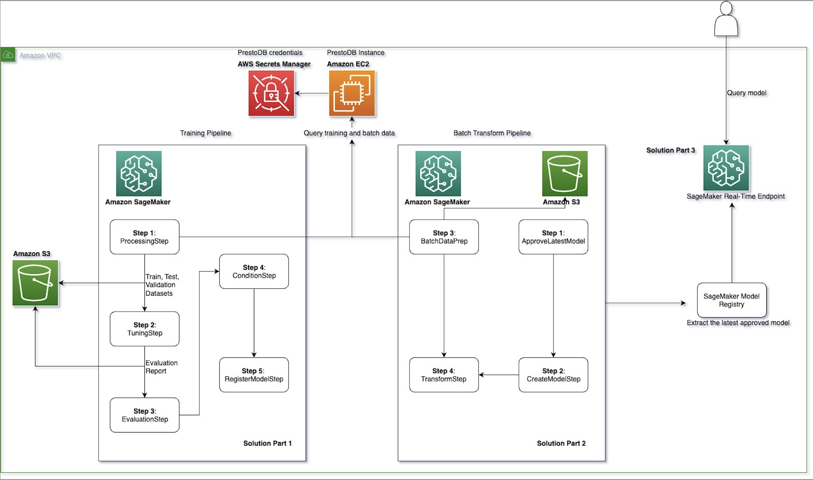

# How Twilio used Amazon SageMaker MLOps Pipelines with PrestoDB to enable frequent model re-training and optimized batch transform


*Amit Arora*, *Madhur Prashant*, *Antara Raisa*, *Johnny Chivers*

***This post is co-written with customer_names from Twilio.***

Today’s leading companies trust [Twilio’s](https://www.twilio.com/en-us)
Customer Engagement Platform (CEP) to build direct, personalized
relationships with their customers everywhere in the world. Twilio
enables companies to use communications and data to add intelligence and
security to every step of the customer journey, from sales to marketing
to growth, customer service and many more engagement use cases in a
flexible, programmatic way. Across 180 countries, millions of developers
and hundreds of thousands of businesses use Twilio to create magical
experiences for their customers. Being one of the largest AWS customers,
Twilio engages with Data and AI/ML services to run their daily
workloads. This blog outlines the steps AWS and Twilio took to migrate
Twilio’s existing Machine Learning Operations (MLOps), the
implementation of training models, and running batch inferences to
Amazon SageMaker.

Machine learning (ML) models do not operate in isolation. They must
integrate into existing production systems and infrastructure to deliver
value. This necessitates considering the entire ML lifecycle during
design and development. With the right processes and tools, MLOps
enables organizations to reliably and efficiently adopt ML across their
teams for their specific use cases. [Amazon
SageMaker](https://aws.amazon.com/sagemaker/) includes a suite of
features for MLOps that includes [Amazon SageMaker
Pipelines](https://aws.amazon.com/sagemaker/pipelines/) and [Amazon
SageMaker model
registry](https://docs.aws.amazon.com/sagemaker/latest/dg/model-registry.html).
Pipelines allow for straightforward creation and management of ML
workflows while also offering storage and reuse capabilities for
workflow steps. Model Registry simplifies model deployment by
centralizing model tracking.

This blog post focuses on enabling AWS customers to have flexibility in
using their data source of choice and integrate it seamlessly with
[Amazon SageMaker Processing
Jobs](https://sagemaker-examples.readthedocs.io/en/latest/sagemaker_processing/scikit_learn_data_processing_and_model_evaluation/scikit_learn_data_processing_and_model_evaluation.html).
Using SageMaker Processing Jobs, you can leverage a simplified, managed
experience to run data pre- or post-processing and model evaluation
workloads on the Amazon SageMaker platform.

Twilio needed to implement an MLOps pipeline that queried data from
[PrestoDB](https://prestodb.io/). PrestoDB is an open-source SQL query
engine that is designed for fast analytic queries against data of any
size from multiple sources.

In this post, we show you a step-by-step implementation to achieve the
following:

-   Read data available in PrestoDB from a SageMaker Processing Job

-   Train a binary classification model using [SageMaker Training
    Jobs](https://sagemaker.readthedocs.io/en/v1.44.4/amazon_sagemaker_operators_for_kubernetes_jobs.html),
    and tune the model using [SageMaker Automatic Model
    Tuning](https://docs.aws.amazon.com/sagemaker/latest/dg/automatic-model-tuning.html)

-   Run a [batch transform
    pipeline](https://docs.aws.amazon.com/sagemaker/latest/dg/batch-transform.html)
    for batch inference on data fetched from PrestoDB

-   Deploy the trained model as a [real-time SageMaker
    endpoint](https://docs.aws.amazon.com/sagemaker/latest/dg/realtime-endpoints.html)

## Use case overview

Twilio trained a binary classification ML model using
[scikit-learn’s](https://scikit-learn.org/stable/)
[`RandomForestClassifier`](https://scikit-learn.org/stable/modules/generated/sklearn.ensemble.RandomForestClassifier.html)
to integrate into their MLOps pipeline. This model is used as part of a
batch process that runs periodically for their daily workloads, making
training and inference workflows repeatable to accelerate model
development. The training data used for this pipeline is made available
via PrestoDB and read into Pandas through the [PrestoDB Python
client](https://pypi.org/project/presto-python-client/).

The end goal was to convert the existing steps into two pipelines: a
training pipeline and a batch transform pipeline that connected the data
queried from PrestoDB to a SageMaker Processing Job, and finally deploy
the trained model to a SageMaker Endpoint for real-time inference.

In this blog, we use an open-source dataset available via the
[TPCH-Connector](https://prestodb.io/docs/current/connector/tpch.html)
that is packaged with PrestoDB to illustrate the end-to-end workflow
that Twilio used. Twilio was able to use this open-source solution to
migrate their existing MLOps pipeline to Amazon SageMaker. All the code
for this open-source solution is available in the
[GitHub](https://github.com/aws-samples/mlops-pipeline-prestodb?tab=readme-ov-file)
repo.

## Solution overview

This solution is divided into three main steps that implement a training
pipeline, a batch transform pipeline, and deploy the trained model as a
real-time SageMaker endpoint for inference:

-   [Model Training
    Pipeline](https://github.com/aws-samples/mlops-pipeline-prestodb/blob/main/0_model_training_pipeline.ipynb):
    In this step, we create a model training pipeline. We connect a
    SageMaker Processing Job to fetch data from a PrestoDB instance,
    train and tune the ML model, evaluate it, and register it with the
    SageMaker Model Registry.
-   [Batch Transform
    Pipeline](https://github.com/aws-samples/mlops-pipeline-prestodb/blob/main/1_batch_transform_pipeline.ipynb):
    In this step, we create a batch transform pipeline. Here, we execute
    a preprocess data step that reads data from a PrestoDB instance and
    runs batch inference on the registered ML model (from the Model
    Registry) that we
    [`approve`](https://docs.aws.amazon.com/sagemaker/latest/dg/model-registry-approve.html)
    as a part of this pipeline. This model is approved either
    programmatically or manually via the Model Registry.
-   [Real-time
    Inference](https://github.com/aws-samples/mlops-pipeline-prestodb/blob/main/2_realtime_inference.ipynb):
    In this step, we deploy the latest approved model as a SageMaker
    Endpoint for [real-Time
    inference](https://docs.aws.amazon.com/sagemaker/latest/dg/realtime-endpoints.html).

## Solution design

The solution design includes setting up the data preparation and
training pipeline, implementing the batch transform pipeline, and
deploying the approved model as a real-time SageMaker endpoint for
inference. All [pipeline
parameters](https://docs.aws.amazon.com/sagemaker/latest/dg/build-and-manage-parameters.html)
used in this solution exist in a single
[config.yml](https://github.com/aws-samples/mlops-pipeline-prestodb/blob/main/config.yml)
file. This file includes the necessary AWS and PrestoDB credentials to
connect to the PrestoDB instance, information on the training
hyperparameters and SQL queries that are executed at training, and
inference steps to read data from PrestoDB. This solution is highly
customizable for industry-specific use cases so that it can be used with
minimal code changes via simple updates in the `config file`.

An example of how a query is configured within the `config.yml` file is
shown below. This query is used at the [data processing
step](https://docs.aws.amazon.com/sagemaker/latest/dg/build-and-manage-steps.html#step-type-processing)
of the training pipeline to fetch data from the PrestoDB instance. Here,
we predict whether an `order` is a `high_value_order` or a
`low_value_order` based on the `orderpriority` as given from the
`TPCH-data`. More information on the `TPCH-data`, its database entities,
relationships, and characteristics can be found
[here](https://www.tpc.org/tpc_documents_current_versions/pdf/tpc-h_v2.17.1.pdf).
Users can change the query for their use case within the config file and
execute the solution with no code changes.

``` sql
    SELECT
        o.orderkey,
        COUNT(l.linenumber) AS lineitem_count,
        SUM(l.quantity) AS total_quantity,
        AVG(l.discount) AS avg_discount,
        SUM(l.extendedprice) AS total_extended_price,
        SUM(l.tax) AS total_payable_tax,
        o.orderdate,
        o.orderpriority,
        CASE
            WHEN (o.orderpriority = '2-HIGH') THEN 1 
            ELSE 0
        END AS high_value_order
    FROM
        orders o
    JOIN
        lineitem l ON o.orderkey = l.orderkey
    GROUP BY
        o.orderkey,
        o.orderdate,
        o.orderpriority
    ORDER BY 
        RANDOM() 
    LIMIT 5000
```

The main steps of this solution are described in detail below:

### Part 1: [Data Preparation and Training Pipeline Step](https://github.com/aws-samples/mlops-pipeline-prestodb/blob/main/0_model_training_pipeline.ipynb):

1.  The training data is read from a PrestoDB instance, and any feature
    engineering needed is done as part of the SQL queries run in
    PrestoDB at retrieval time. The queries that are used to fetch data
    at training and batch inference steps are configured in the
    `config file`.
2.  We use the
    [FrameworkProcessor](https://docs.aws.amazon.com/sagemaker/latest/dg/processing-job-frameworks.html)
    with SageMaker Processing Jobs to read data from PrestoDB using the
    `Python PrestoDB client`.
3.  For the training and tuning step, we use the [SKLearn
    estimator](https://sagemaker.readthedocs.io/en/stable/frameworks/sklearn/sagemaker.sklearn.html)
    from the SageMaker SDK and the `RandomForestClassifier` from
    `scikit-learn` to train the ML model. The
    [HyperparameterTuner](https://sagemaker.readthedocs.io/en/stable/api/training/tuner.html)
    class is used for running automatic model tuning that finds the best
    version of the model by running many training jobs on the dataset
    using the algorithm and the ranges of hyperparameters.
4.  The [model
    evaluation](https://sagemaker-examples.readthedocs.io/en/latest/sagemaker-pipelines/tabular/abalone_build_train_deploy/sagemaker-pipelines-preprocess-train-evaluate-batch-transform.html)
    step is to check that the trained and tuned model has an accuracy
    level above a user-defined threshold and only then [register that
    model](https://docs.aws.amazon.com/sagemaker/latest/dg/model-registry.html)
    within the model registry. If the model accuracy does not meet the
    threshold, then the pipeline fails and the model is not registered
    with the model registry.
5.  The model training pipeline is then run with the
    [`pipeline.start`](https://docs.aws.amazon.com/sagemaker/latest/dg/run-pipeline.html)
    which triggers and instantiates all the steps mentioned above.

### Part 2: [Batch Transform Step](https://github.com/aws-samples/mlops-pipeline-prestodb/blob/main/1_batch_transform_pipeline.ipynb):

1.  The batch transform pipeline implements a data preparation step that
    retrieves data from a PrestoDB instance (using a [data preprocessing
    script](https://github.com/aws-samples/mlops-pipeline-prestodb/blob/main/code/presto_preprocess_for_batch_inference.py))
    and stores the batch data in [Amazon Simple Storage
    Service](https://aws.amazon.com/pm/serv-s3/?gclid=Cj0KCQjw2a6wBhCVARIsABPeH1sVCmK3CK8Vsv31A4fjV79s5YkxGqKoyDuv2rPuoBDfDqwh7ZiYaTQaAkeOEALw_wcB&trk=fecf68c9-3874-4ae2-a7ed-72b6d19c8034&sc_channel=ps&ef_id=Cj0KCQjw2a6wBhCVARIsABPeH1sVCmK3CK8Vsv31A4fjV79s5YkxGqKoyDuv2rPuoBDfDqwh7ZiYaTQaAkeOEALw_wcB:G:s&s_kwcid=AL!4422!3!536452728638!e!!g!!amazon%20s3!11204620052!112938567994)
    (S3).
2.  The latest model registered in the Model Registry from the training
    pipeline is approved.
3.  A
    [Transformer](https://sagemaker.readthedocs.io/en/stable/api/inference/transformer.html)
    instance is used which runs a batch transform job to get inferences
    on the entire dataset stored in S3 from the data preparation step
    and store the output in S3.

### Part 3: [Real-Time SageMaker Endpoint Support](https://github.com/aws-samples/mlops-pipeline-prestodb/blob/main/2_realtime_inference.ipynb):

1.  The latest approved model is retrieved from the model registry using
    the
    [describe_model_package](https://boto3.amazonaws.com/v1/documentation/api/latest/reference/services/sagemaker/client/describe_model_package.html)
    function from the SageMaker SDK.
2.  The latest approved model is deployed as a real-time SageMaker
    endpoint.
3.  The model is deployed on a `ml.c5.xlarge` instance with a minimum
    instance count of 1 and a maximum instance count of 3 (configurable
    by the user) with the [automatic scaling
    policy](https://docs.aws.amazon.com/sagemaker/latest/dg/endpoint-auto-scaling.html)
    `ENABLED`. This removes unnecessary instances so that you don’t pay
    for provisioned instances that you aren’t using.

## Prerequisites

To implement the solution provided in this post, you should have an [AWS
account](https://signin.aws.amazon.com/signin?redirect_uri=https%3A%2F%2Fportal.aws.amazon.com%2Fbilling%2Fsignup%2Fresume&client_id=signup),
set up an [Amazon SageMaker
Domain](https://docs.aws.amazon.com/sagemaker/latest/dg/sm-domain.html)
to access [SageMaker Studio](https://aws.amazon.com/sagemaker/studio/),
and have familiarity with SageMaker, S3, and PrestoDB.

The following prerequisites need to be in place before running this
code:

#### PrestoDB

-   We use the built-in datasets available in PrestoDB via the
    `TPCH-connector` for this solution. Follow the instructions in the
    GitHub
    [README.md](https://github.com/aws-samples/mlops-pipeline-prestodb?tab=readme-ov-file#prestodb)
    to set up PrestoDB on an Amazon EC2 instance in your account. ***If
    you already have access to a PrestoDB instance, then you can skip
    this section but keep its connection details handy (see the `presto`
    section in the `config` file)***. Once you have your PrestoDB
    credentials, fill out the `presto` section in the `config` as given
    below. Enter your host `public IP`, `port`, `credentials`, `catalog`
    and `schema`:

``` yaml
presto:
  host: <0.0.0.0>
  parameter: "0000"
  presto_credentials: <presto_credentials>
  catalog: <catalog>
  schema: <schema>
```

#### [Amazon VPC](https://aws.amazon.com/vpc/) Network Configurations

-   We also define the encryption, network isolation, and VPC
    configurations of the ML model and operations in the `config` file.
    In the `aws` section, specify the `enable_network_isolation` status,
    `security_group_ids`, and `subnets` based on your network isolation
    preferences. View more information on network configurations and
    preferences
    [here](https://docs.aws.amazon.com/sagemaker/latest/dg/mkt-algo-model-internet-free.html):

``` yaml
network_config:
    enable_network_isolation: false
    security_group_ids: 
    - <security_group_id>
    subnets:
    - <subnet-1>
    - <subnet-2>
    - <subnet-3>
```

#### IAM Role

Set up an execution role in [AWS Identity and Access Management
(IAM)](https://aws.amazon.com/iam/) with appropriate permissions to
allow SageMaker to access [AWS Secrets
Manager](https://docs.aws.amazon.com/secretsmanager/latest/userguide/intro.html)
and S3. ***Until an AWS CloudFormation template is provided that creates
the role with the requisite IAM permissions, use a SageMaker execution
role that AmazonSageMakerFullAccess AWS managed policy for your
execution role.***

#### AWS Secrets Manager

Setup a secret in Secrets Manager for the PrestoDB username and
password. Call the secret `prestodb-credentials` and add a `username`
field to it and a `password` field to it. For instructions on creating
and managing secrets via `Secrets Manager`, view [this
link](https://docs.aws.amazon.com/secretsmanager/latest/userguide/managing-secrets.html).

### Steps to run

1.  Clone the [GitHub
    repository](https://github.com/aws-samples/mlops-pipeline-prestodb.git)
    in SageMaker Studio. Follow this
    [link](https://docs.aws.amazon.com/sagemaker/latest/dg/studio-tasks-git.html)
    to view instructions on cloning a git repository in SageMaker
    Studio.

2.  Edit the `config.yml` file as follows:

    -   Edit the parameter values in the `presto` section. These
        parameters define the connectivity to PrestoDB.
    -   Edit the parameter values in the `aws` section. These parameters
        define the network connectivity, IAM role, bucket name, region,
        and other AWS cloud-related parameters.
    -   Edit the parameter values in the sections corresponding to the
        pipeline steps, i.e., `training_step`, `tuning_step`,
        `transform_step` etc.
    -   Review all the parameters in these sections carefully, and edit
        them as appropriate for your use case.

## Testing the solution

### AWS Architecture

Once the prerequisites are complete and the `config.yml` file is set up
correctly, we are ready to run the
[`mlops-pipeline-prestodb`](https://github.com/aws-samples/mlops-pipeline-prestodb/tree/main)
solution. View the architecture diagram for a visual representation of
the steps that we implement. This diagram shows the following three
steps: the training pipeline, the batch transform pipeline, and
deploying the model as a SageMaker real-time endpoint:



-   **Solution Part 1**: Shows the architectural representation of the
    training pipeline. This includes the data preprocessing step, the
    training and tuning step, the model evaluation step, the condition
    step, and lastly, the register model step. The train, test,
    validation datasets, and [evaluation
    report](https://sagemaker-examples.readthedocs.io/en/latest/sagemaker-pipelines/tabular/abalone_build_train_deploy/sagemaker-pipelines-preprocess-train-evaluate-batch-transform.html)
    that are generated in this pipeline are sent to an S3 bucket.
-   **Solution Part 2**: Shows the architectural representation of the
    batch transform pipeline. This includes the batch data preprocessing
    step, approving the latest model from the model registry, creating
    the model instance, and performing batch transformation on data that
    is stored and retrieved from an S3 bucket.
    -   The PrestoDB server is hosted on an Amazon EC2 instance, with
        credentials stored in [AWS Secrets
        Manager](https://aws.amazon.com/secrets-manager/).
-   **Solution Part 3**: Finally, the latest approved model from the
    SageMaker Model Registry is deployed as a SageMaker Real-Time
    Endpoint for inference.

### Solution Walkthrough

------------------------------------------------------------------------

1.  **Training Pipeline**: On the left panel in [SageMaker
    Studio](https://aws.amazon.com/sagemaker/studio/), choose
    **0_model_training_pipeline.inpynb** in the navigation pane. When
    the notebook is open, on the Run menu, choose **Run All Cells** to
    run the code in this notebook. This notebook demonstrates how
    SageMaker Pipelines can be used to string together a sequence of
    data processing, model training, tuning, and evaluation steps to
    train a binary classification ML model using scikit-learn. At the
    end of this run, navigate to `pipelines` on the Studio Navigation
    pane:

    **After executing the entire training pipeline, your pipeline
    structure on [Amazon SageMaker
    Pipelines](https://docs.aws.amazon.com/sagemaker/latest/dg/pipelines-sdk.html)
    should look like this:**

    
    ***The training pipeline consists of the following steps that are
    implemented through the notebook run***:

    1.  **Preprocess data step**: In this step of the pipeline, we
        create a processing job for data pre-processing. For more
        information on processing jobs, see [Process
        Data](https://docs.aws.amazon.com/sagemaker/latest/dg/processing-job.html).
        We use a [preprocess
        script](https://github.com/aws-samples/mlops-pipeline-prestodb/blob/main/code/presto_preprocess_for_training.py)
        that is used to connect and query data from a PrestoDB instance
        using the user-specified `SQL query` in the config file. This
        step splits and sends data retrieved from PrestoDB as `tain`,
        `test`, and `validation` files to an S3 bucket. The ML model is
        trained using the data in these files.

        The
        [sklearn_processor](https://docs.aws.amazon.com/sagemaker/latest/dg/use-scikit-learn-processing-container.html)
        is used in the
        [`ProcessingStep`](https://docs.aws.amazon.com/sagemaker/latest/dg/build-and-manage-steps.html#step-type-processing)
        to run the scikit-learn script that preprocesses data. The step
        is defined as follows:

        ``` python
        # declare the sk_learn processer
        step_args = sklearn_processor.run(
                ## code refers to the data preprocessing script that is responsible for querying data from the PrestoDB instance
                code=config['scripts']['preprocess_data'],
                source_dir=config['scripts']['source_dir'], 
                outputs=outputs_preprocessor,
                arguments=[
                    "--host", host_parameter,
                    "--port", port_parameter,
                    "--presto_credentials_key", presto_parameter,
                    "--region", region_parameter,
                    "--presto_catalog", presto_catalog_parameter,
                    "--presto_schema", presto_schema_parameter,
                    "--train_split", train_split.to_string(), 
                    "--test_split", test_split.to_string(),
                ],
            )

            step_preprocess_data = ProcessingStep(
                name=config['data_processing_step']['step_name'],
                step_args=step_args,
            )
        ```

        Here, we use the `config['scripts']['source_dir']` which points
        to the data preprocessing script that connects to the PrestoDB
        instance. Parameters used as arguments in
        [`step_args`](https://docs.aws.amazon.com/sagemaker/latest/dg/build-and-manage-steps.html#:~:text=%2C%0A%20%20%20%20sagemaker_session%3Dpipeline_session%2C%0A-,step_args,-%3D%20pyspark_processor.run(%0A%20%20%20%20inputs))
        are configurable and fetched from the `config file`.

    2.  **Train Model Step**: In this step of the pipeline, we create a
        training job to train a model. For more information on training
        jobs, see [Train a Model with Amazon
        SageMaker](https://docs.aws.amazon.com/sagemaker/latest/dg/how-it-works-training.html).
        Here, we use the [Scikit Learn
        Estimator](https://sagemaker.readthedocs.io/en/stable/frameworks/sklearn/sagemaker.sklearn.html)
        from the SageMaker SDK to handle end-to-end training and
        deployment of custom Scikit-learn code. The
        `RandomForestClassifier` is used to train the ML model for our
        binary classification use case. The `HyperparameterTuner` class
        is used for running automatic model tuning to determine the set
        of hyperparameters that provide the best performance based on a
        user-defined metric threshold (for example, maximizing the AUC
        metric).

        -   In the code below, the `sklearn_estimator` object is used
            with parameters that are configured in the `config file` and
            uses a [training
            script](https://github.com/aws-samples/mlops-pipeline-prestodb/blob/main/code/training.py)
            to train the ML model. This step accesses the `train`,
            `test` and `validation` files that were created as a part of
            the previous data preprocessing step.

            ``` python
            # declare a tuning step to use the train and test data to tune the ML model using the `HyperparameterTuner` declared above
            step_tuning = TuningStep(
                name=config['tuning_step']['step_name'],
                tuner=rf_tuner,
                inputs={
                    "train": TrainingInput(
                        s3_data=step_preprocess_data.properties.ProcessingOutputConfig.Outputs[
                            "train" ## refer to this
                        ].S3Output.S3Uri,
                        content_type="text/csv",
                    ),
                    "test": TrainingInput(
                    s3_data=step_preprocess_data.properties.ProcessingOutputConfig.Outputs["test"].S3Output.S3Uri,
                    content_type="text/csv",
                    ),
                },
            )
            ```

    3.  **Evaluate model step**: This step in the pipeline checks if the
        trained and tuned model has an accuracy level above a
        user-defined threshold, and only then registers the model with
        the model registry. If the model accuracy does not meet the
        [user-defined
        threshold](https://sagemaker-examples.readthedocs.io/en/latest/sagemaker-pipelines/tabular/abalone_build_train_deploy/sagemaker-pipelines-preprocess-train-evaluate-batch-transform.html#Define-a-Model-Evaluation-Step-to-Evaluate-the-Trained-Model)
        then the pipeline fails and the model is not registered with the
        model registry. We use the
        [`ScriptProcessor`](https://docs.aws.amazon.com/sagemaker/latest/dg/processing-container-run-scripts.html)
        with an [evaluation
        script](https://github.com/aws-samples/mlops-pipeline-prestodb/blob/main/code/evaluate.py)
        that a user creates to evaluate the trained model based on a
        metric of choice.

        -   The evaluation step uses the `evaluation script` as a code
            entry. This script prepares the features, target values and
            calculates the prediction probabilities using
            `model.predict`. At the end of the run, an
            `evaluation report` is sent to S3 that contains information
            on `precision, recall, accuracy` metrics.

        ``` python
        step_evaluate_model = ProcessingStep(
            name=config['evaluation_step']['step_name'],
            processor=evaluate_model_processor,
            inputs=[
                ProcessingInput(
                    source=step_tuning.get_top_model_s3_uri(top_k=0, s3_bucket=bucket),
                    destination="/opt/ml/processing/model",
                    input_name="model.tar.gz" 
                ),
                ProcessingInput(
                    source=step_preprocess_data.properties.ProcessingOutputConfig.Outputs["test"].S3Output.S3Uri,
                    destination="/opt/ml/processing/test",
                    input_name="test.csv" 
                ),
            ],
            outputs=[
                ProcessingOutput(
                    output_name="evaluation",
                    source="/opt/ml/processing/evaluation",
                    destination=Join(
                        on="/",
                        values=[
                            "s3://{}".format(bucket),
                            prefix,
                            ExecutionVariables.PIPELINE_EXECUTION_ID,
                            "evaluation",
                        ]
                    )
                )
            ],
            code = config['scripts']['evaluation'],
            property_files=[evaluation_report],
            job_arguments=[
                "--target", target_parameter,
                "--features", feature_parameter,
            ]
        )
        ```

        -   Once the evaluation step is complete, metrics like
            `Accuracy`, `Precision` and `Recall` can be analyzed from
            the `evaluation report` that is sent to the S3 bucket. View
            the image of an evaluation report sent below:

        

    4.  **Condition model step**: Once the model is evaluated, we can
        add conditions to the pipeline with a
        [ConditionStep](https://sagemaker.readthedocs.io/en/stable/workflows/pipelines/sagemaker.workflow.pipelines.html).
        This step registers the model only if the given user-defined
        metric threshold is met. In our solution, we only want to
        register the new model version with the Model Registry if the
        new model meets a specific accuracy condition of above `70%`.

        ``` python
        # Create a SageMaker Pipelines ConditionStep, using the condition above.
        # Enter the steps to perform if the condition returns True / False.
        step_cond = ConditionStep(
            name=config['condition_step']['step_name'],
            conditions=[cond_gte],
            if_steps=[step_register_model],
            else_steps=[step_fail], ## if this fails
        )
        ```

        If the `accuracy condition` is not met, a `step_fail` step is
        executed that sends an error message to the user, and the
        pipeline fails. For instance, since the user-defined
        `accuracy condition` is set to `0.7` in the `config file`, and
        the Accuracy calculated during the evaluation step exceeds it
        (`73.8% > 70%`), the `outcome` of this step is set to `True` and
        the model moves to the last step of the training pipeline.

    5.  **Register model step**: This `RegisterModel` step is to
        register a
        [sagemaker.model.Model](https://sagemaker.readthedocs.io/en/stable/api/inference/model.html)
        or a
        [sagemaker.pipeline.PipelineModel](https://sagemaker.readthedocs.io/en/stable/api/inference/pipeline.html#pipelinemodel)
        with the Amazon SageMaker model registry. Once the trained model
        meets the model performance requirements, a new version of the
        model is registered with the `SageMaker Model Registry`.

        ***The model is registered with the `model registry` with an
        approval status set to `PendingManualApproval`. This means the
        model cannot be deployed on a SageMaker endpoint unless its
        status in the registry is changed to `Approved` manually via the
        SageMaker console, programmatically or through an
        [`AWS Lambda`](https://aws.amazon.com/pm/lambda/?gclid=CjwKCAjwoa2xBhACEiwA1sb1BOKhFzqMbSWe815ewC8bKXkO4w55mmsJibArB3J7kMDiMASvd-mwABoCcJgQAvD_BwE&trk=73f686c8-9606-40ad-852f-7b2bcafa68fe&sc_channel=ps&ef_id=CjwKCAjwoa2xBhACEiwA1sb1BOKhFzqMbSWe815ewC8bKXkO4w55mmsJibArB3J7kMDiMASvd-mwABoCcJgQAvD_BwE:G:s&s_kwcid=AL!4422!3!651212652666!e!!g!!amazon%20lambda!909122559!45462427876)
        function.***

        ***Now that the model is registered, you can get access to the
        registered model manually on the SageMaker Studio Model Registry
        console or programmatically in the next notebook, approve it,
        and run the second portion of this solution: Batch Transform
        Step***

2.  **Batch Transform Pipeline**: Next Choose
    [`1_batch_transform_pipeline.ipynb`](https://github.com/aws-samples/mlops-pipeline-prestodb/blob/main/1_batch_transform_pipeline.ipynb).
    When the notebook is open, on the Run menu, choose **Run All Cells**
    to run the code in this notebook. This notebook will run a batch
    transform pipeline using the model trained in the previous notebook.

    **At the end of the batch transform pipeline execution, your
    pipeline structure on Amazon SageMaker Pipelines should look like
    this:**

    
    ***The batch transform pipeline consists of the following steps that
    are implemented through the notebook run:***

    1.  **Extract the latest approved model from the SageMaker Model
        Registry**: In this step of the pipeline, we extract the latest
        model from the Model Registry and set the `ModelApprovalStatus`
        to `Approved`:

        ``` python
        ## updating the latest model package to approved status to use it for batch inference
        model_package_update_response = sm.update_model_package(
            ModelPackageArn=latest_model_package_arn,
            ModelApprovalStatus="Approved",
        )
        ```

        Now we have extracted the latest model from the SageMaker Model
        Registry and programmatically approved it. You can also approve
        the model manually on the `SageMaker Model Registry` page in
        SageMaker Studio as shown in the image below.

        

    2.  **Read raw data for inference from PrestoDB and store it in an
        Amazon S3 bucket**: Once the latest model is approved, batch
        data is fetched from the PrestoDB instance and used for the
        batch transform step. In this step, we use a [batch preprocess
        script](https://github.com/aws-samples/mlops-pipeline-prestodb/blob/main/code/presto_preprocess_for_batch_inference.py)
        that queries data from PrestoDB and saves it in a batch
        directory within an S3 bucket. The query that is used to fetch
        batch data is configured by the user within the `config file` in
        the `transform_step` section.

        ``` python
        # declare the batch step that is called later in pipeline execution
        batch_data_prep = ProcessingStep(
            name=config['data_processing_step']['step_name'],
            step_args=step_args,
        )
        ```

        Once the batch data is extracted into the S3 bucket, create a
        model instance and point to the
        [‘inference.py’](https://github.com/aws-samples/mlops-pipeline-prestodb/blob/main/code/inference.py)
        script, which contains code that runs as part of getting
        inference from the trained model.

        ``` python
        # create the model image based on the model data and refer to the inference script as an entry point for batch inference
        model = Model(
            image_uri=image_uri,
            entry_point=config['scripts']['batch_inference'],
            model_data=model_data_url,
            sagemaker_session=pipeline_session,
            role=role,
        )
        ```

    3.  **Create a batch transform step to perform inference on the
        batch data stored in S3**: Now that a model instance is created,
        create a
        [Transformer](https://sagemaker.readthedocs.io/en/stable/api/inference/transformer.html)
        instance with the appropriate model type, compute instance type,
        and desired output S3 URI. Specifically, pass in the `ModelName`
        from the
        [`CreateModelStep`](https://docs.aws.amazon.com/sagemaker/latest/APIReference/API_CreateModel.html),
        `step_create_model` properties. The `CreateModelStep` properties
        attribute matches the object model of the `DescribeModel`
        response object. Use a `transform step` for batch transformation
        to run inference on an entire dataset. For more information
        about batch transform, see [Run Batch Transforms with Inference
        Pipelines](https://docs.aws.amazon.com/sagemaker/latest/dg/inference-pipeline-batch.html).

        -   A transform step requires a transformer and the data on
            which to run batch inference.

            ``` python
            transformer = Transformer(
            model_name=step_create_model.properties.ModelName,
            instance_type=config['transform_step']['instance_type'],
            instance_count=config['transform_step']['instance_count'],
            strategy="MultiRecord",
            accept="text/csv",
            assemble_with="Line",
            output_path=f"s3://{bucket}",
            tags = config['transform_step']['tags'], 
            env={
                'START_TIME_UTC': st.strftime('%Y-%m-%d %H:%M:%S'), 
                'END_TIME_UTC': et.strftime('%Y-%m-%d %H:%M:%S'),
            })
            ```

        -   Now that the transformer object is created, pass the
            transformer input (which contains the batch data from the
            `batch preprocess` step) into the `TransformStep`
            declaration. Store the output of this pipeline in an S3
            bucket.

        ``` python
        step_transform = TransformStep(
            name=config['transform_step']['step_name'], transformer=transformer, inputs=transform_input, 
        )
        ```

3.  **SageMaker Real-Time Inference**: Lastly, choose
    [`2_realtime_inference.ipynb`](https://github.com/aws-samples/mlops-pipeline-prestodb/blob/main/2_realtime_inference.ipynb).
    When the notebook is open, on the Run menu, choose **Run All Cells**
    to run the code in this notebook. This notebook extracts the latest
    approved model from the Model Registry and deploys it as a SageMaker
    endpoint for real-time inference. It does so by executing the
    following steps:

    1.  **Extract the latest approved model from the SageMaker Model
        Registry**: To deploy a real-time SageMaker endpoint, first
        fetch the `image uri` of your choice and extract the latest
        approved model from the Model Registry. Once the latest approved
        model is extracted, we use a container list with the specified
        `inference.py` as the script for the deployed model to use at
        inference. This model creation and endpoint deployment are
        specific to the [scikit-learn
        model](https://sagemaker.readthedocs.io/en/stable/frameworks/sklearn/sagemaker.sklearn.html)
        configuration.

        In this code, we use the `inference.py` file specific to the
        scikit-learn model. We then create our endpoint configuration,
        setting our `ManagedInstanceScaling` to `ENABLED` with our
        desired `MaxInstanceCount` and `MinInstanceCount` for automatic
        scaling:

        ``` python
        create_endpoint_config_response = sm.create_endpoint_config(
        EndpointConfigName = endpoint_config_name,
        ProductionVariants=[{
            'InstanceType': instance_type,
            # have max instance count configured here
            'InitialInstanceCount': min_instances,
            'InitialVariantWeight': 1,
            'ModelName': model_name,
            'VariantName': 'AllTraffic', 
            # change your managed instance configuration here
            "ManagedInstanceScaling":{
                "MaxInstanceCount": max_instances,
                "MinInstanceCount": min_instances,
                "Status": "ENABLED",}
        }])
        ```

    2.  **Run inferences on the deployed real time endpoint**: Once you
        have extracted the latest approved model, created the model from
        the desired `image uri`, and configured the
        `Endpoint configuration`, you can then deploy it as a real-time
        SageMaker endpoint.

        ``` python
        create_endpoint_response = sm.create_endpoint(
        EndpointName=endpoint_name,
        EndpointConfigName=endpoint_config_name)

        # wait for endpoint to reach a terminal state (InService) using describe endpoint
        describe_endpoint_response = sm.describe_endpoint(EndpointName=endpoint_name)

        while describe_endpoint_response["EndpointStatus"] == "Creating":
            describe_endpoint_response = sm.describe_endpoint(EndpointName=endpoint_name)
        ```

        Upon deployment, you can view the endpoint in service on the
        SageMaker Endpoints under the Inference option on the left
        panel: 

    3.  **Now, run inference against the data extracted from PrestoDB**:

        ``` python
        body_str = "total_extended_price,avg_discount,total_quantity\n1,2,3\n66.77,12,2"

        response = smr.invoke_endpoint(
            EndpointName=endpoint_name,
            Body=body_str.encode('utf-8') ,
            ContentType='text/csv',
        )

        response_str = response["Body"].read().decode()
        response_str
        ```

## Results

Here is a compilation of some queries and responses generated by our
implementation during the real time endpoint deployment stage: \[to add
results here, querying data, fetching it, making predictions, etc.\]

<table style="width:50%;">
<caption>mlops-pipeline-prestodb results</caption>
<colgroup>
<col style="width: 25%" />
<col style="width: 25%" />
</colgroup>
<thead>
<tr class="header">
<th>Query</th>
<th>Answer</th>
</tr>
</thead>
<tbody>
<tr class="odd">
<td>total_extended_price,avg_discount,total_quantity,2,3,12,2</td>
<td>– response –</td>
</tr>
</tbody>
</table>

mlops-pipeline-prestodb results

## Clean Up Steps

If you decide to clean up the endpoint in service, navigate to the
`endpoints` section under `inference` on the SageMaker console, select
the endpoint to be deleted, click on `Actions` and delete the endpoint
to avoid extra charges.


## Conclusion

We have demonstrated an end-to-end MLOps solution on SageMaker. The
process involved fetching data by connecting a SageMaker Processing Job
to a PrestoDB instance, followed by training, evaluating, and
registering the model. We approved the latest registered model from the
training pipeline and ran batch inference against it using batch data
queried from PrestoDB and stored in S3. Furthermore, we deployed the
latest approved model as a real-time SageMaker endpoint to run
inferences.

The rise of [generative AI](https://aws.amazon.com/generative-ai/)
increases the demand for training, deploying, and running ML models, and
consequently, the use of data. By integrating SageMaker Processing Jobs
with PrestoDB, you can seamlessly migrate your workloads to SageMaker
pipelines without additional data preparation, storage, or accessibility
burdens. You can build, train, evaluate, run batch inferences, and
deploy models as real-time endpoints while leveraging your existing data
engineering pipelines with minimal or no code changes.

Explore SageMaker Pipelines, open-source data querying engines like
PrestoDB, and build a solution using the sample implementation provided.

Get started today by refering to this [GitHub
repository](https://github.com/aws-samples/mlops-pipeline-prestodb.git).

For more information and tutorials on SageMaker Pipelines, refer to the
[SageMaker Pipelines
Documentation](https://docs.aws.amazon.com/search/doc-search.html?searchPath=documentation&searchQuery=sagemaker+pipelines).

Portions of this code are released under the [Apache 2.0
License](https://aws.amazon.com/apache-2-0/)

------------------------------------------------------------------------

## Author bio

Amit
Arora is an AI and ML Specialist Architect at Amazon Web Services,
helping enterprise customers use cloud-based machine learning services
to rapidly scale their innovations. He is also an adjunct lecturer in
the MS data science and analytics program at Georgetown University in
Washington D.C.

<br><br>

Madhur
Prashant is an AI and ML Solutions Architect at Amazon Web Services. He
is passionate about the intersection of human thinking and generative
AI. His interests lie in generative AI, specifically building solutions
that are helpful and harmless, and most of all optimal for customers.
Outside of work, he loves doing yoga, hiking, spending time with his
twin, and playing the guitar.

<br><br>

Antara
Raisa is an AI and ML Solutions Architect at Amazon Web Services
supporting Strategic Customers based out of Dallas, Texas. She also has
previous experience working with large enterprise partners at AWS, where
she worked as a Partner Success Solutions Architect for digital native
customers.

<br><br>

Johnny
is a Senior Solutions Architect working within the Strategic Accounts
team at AWS. With over 10 years of experience helping customers adopt
new technologies, he guides them through architecting end-to-end
solutions spanning infrastructure, big data, and AI.
